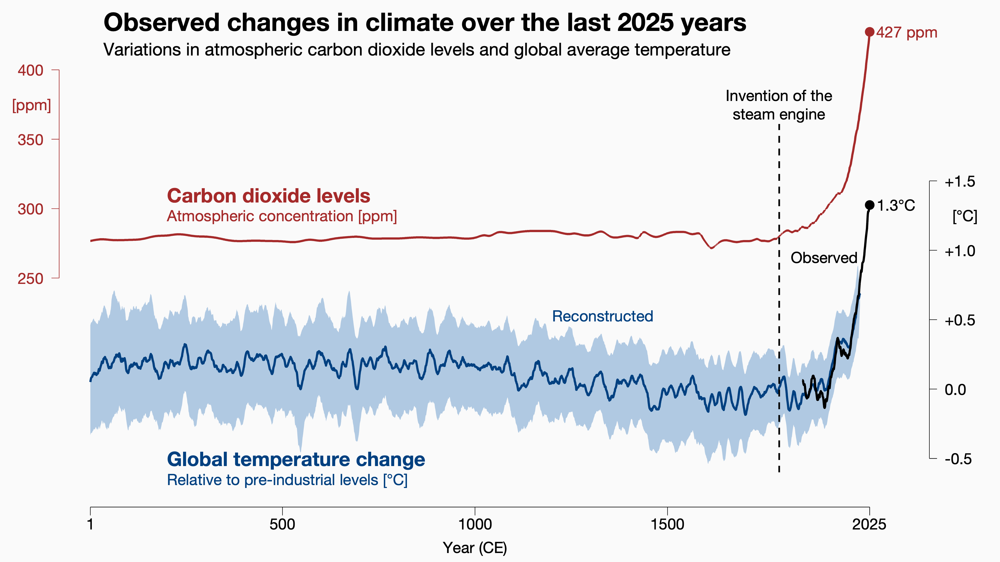
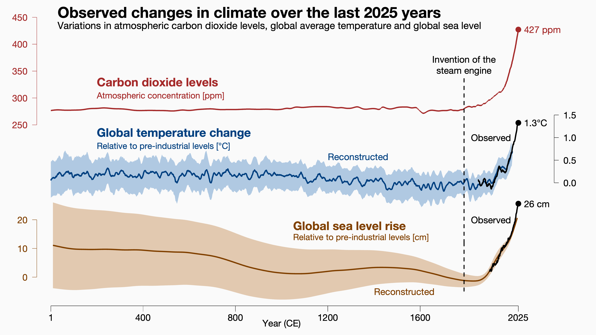
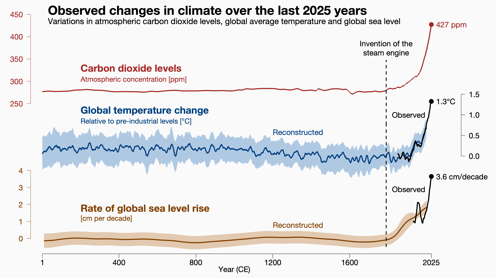
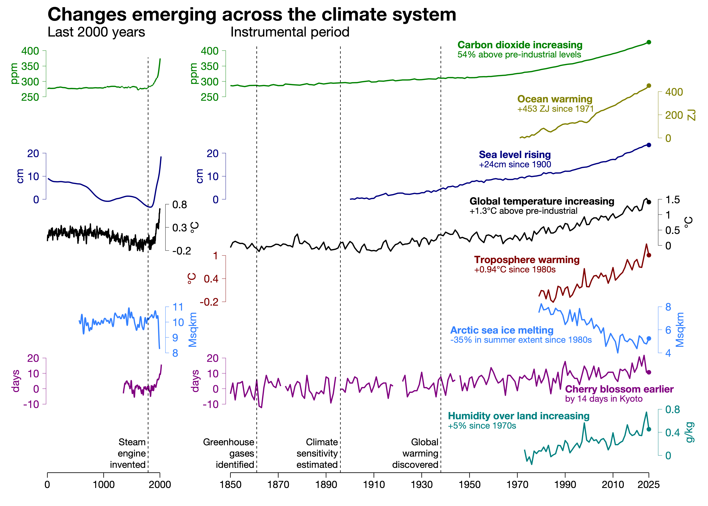
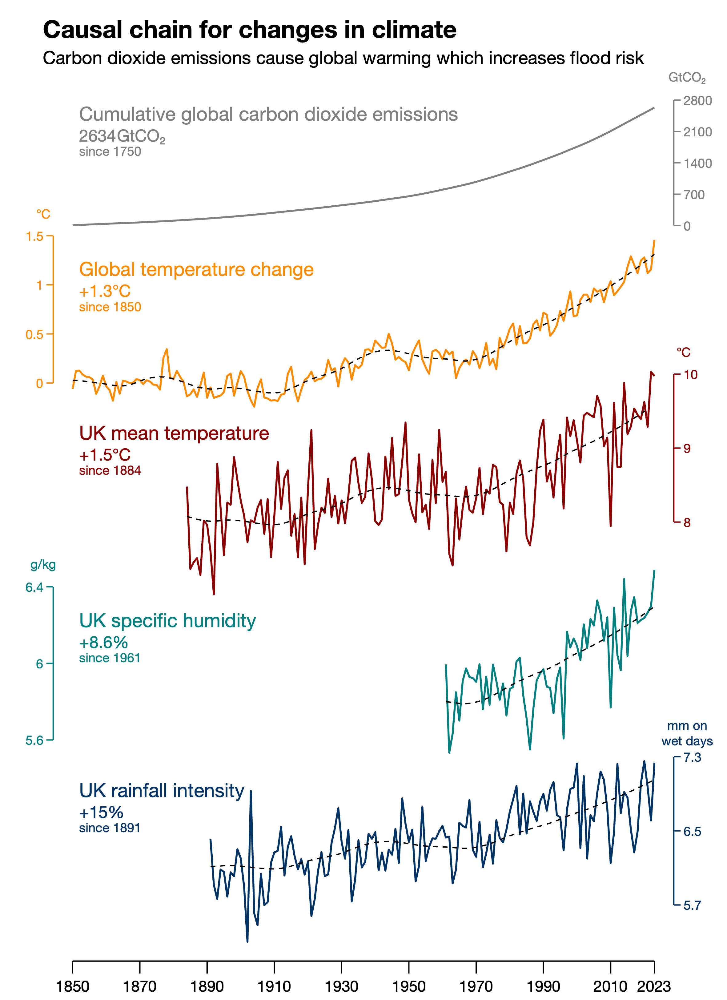
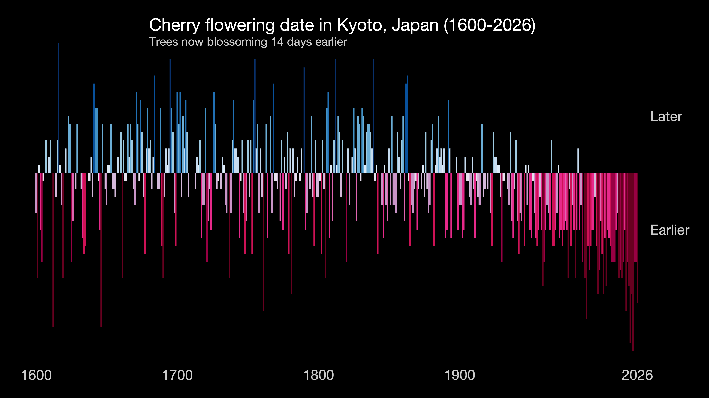

## Climate indicators

### Just global temperature and carbon dioxide

### Global temperature, carbon dioxide and sea level rise

### Global temperature, carbon dioxide and rate of sea level rise

### Full set of climate indicators including last 2000 years where available

### Causal chain highlighting how the UK is affected by global emissions

### Cherry blossom dates in Japan over the last 400+ years

