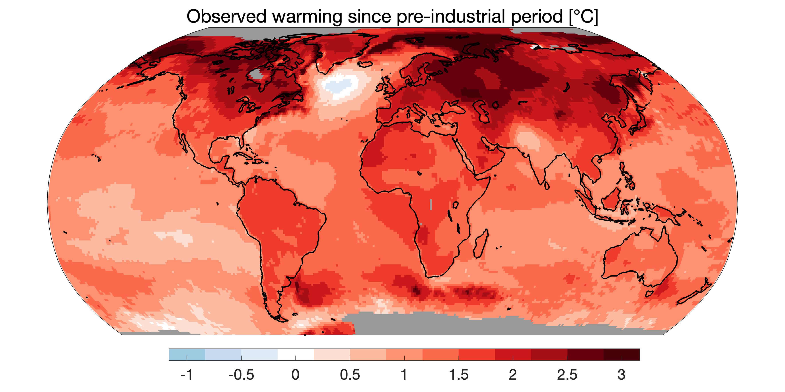
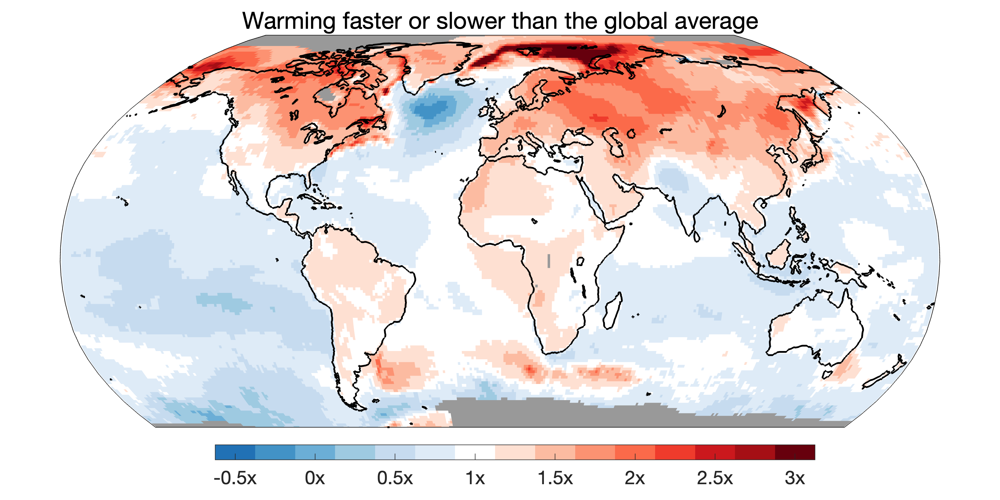
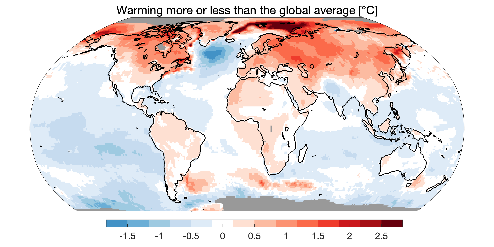
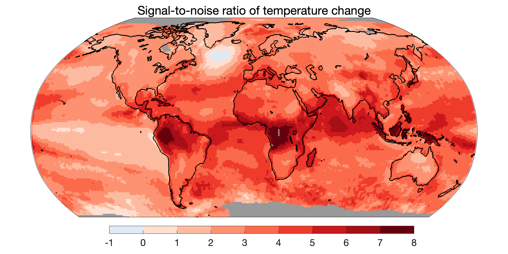
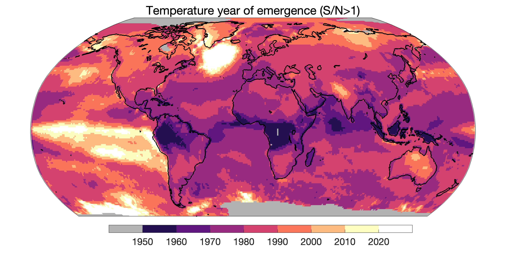

## Maps of warming

### Temperature change since pre-industrial

### Warming faster or slower than global average

### Warming more or less than global average

### Signal-to-noise for annual temperature change

### Year of emergence for annual temperature change

