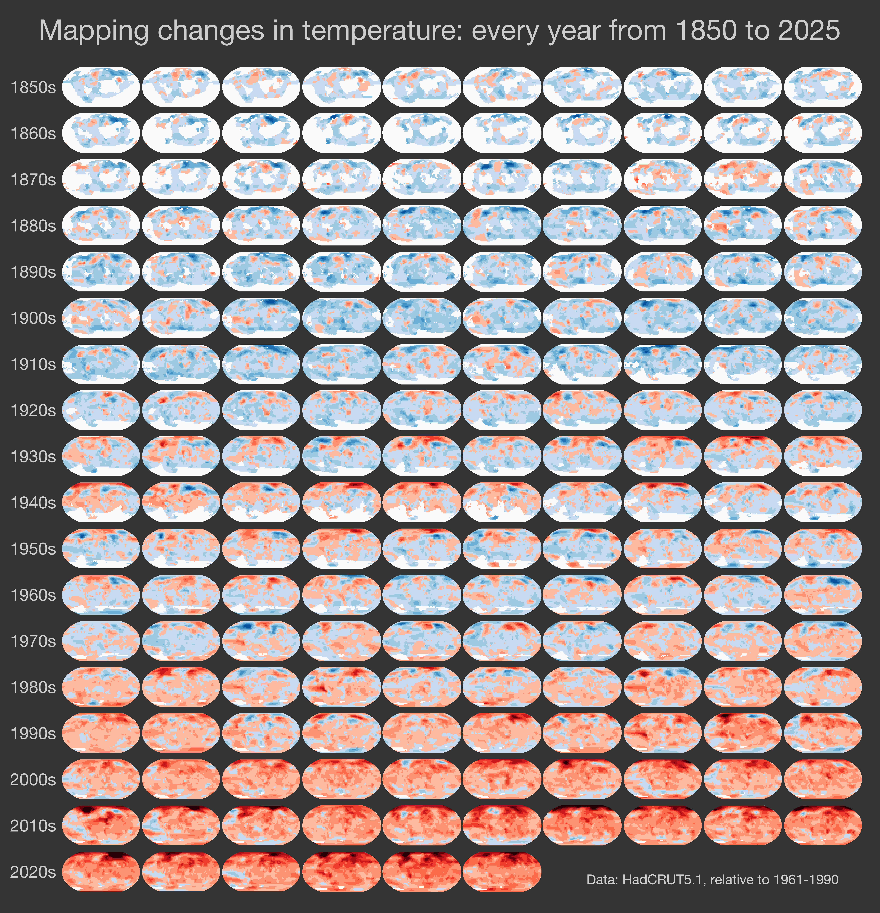
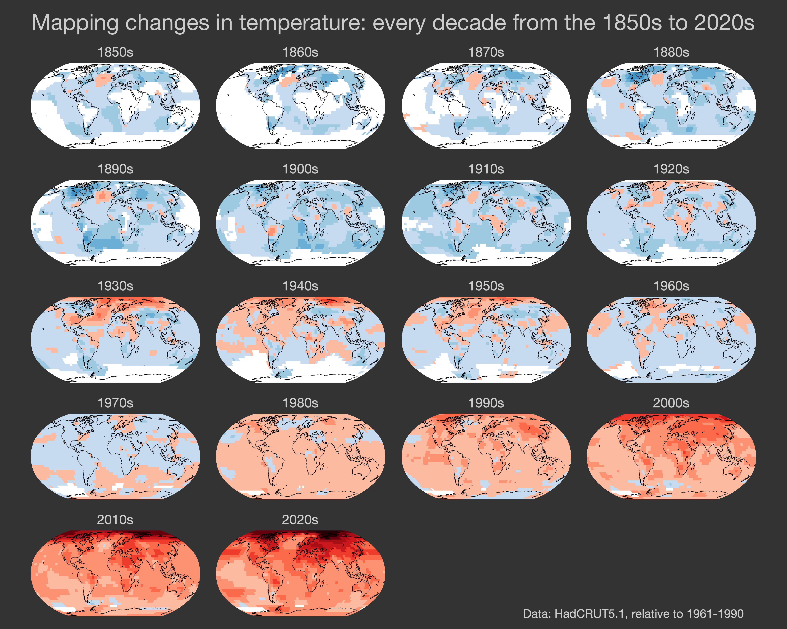
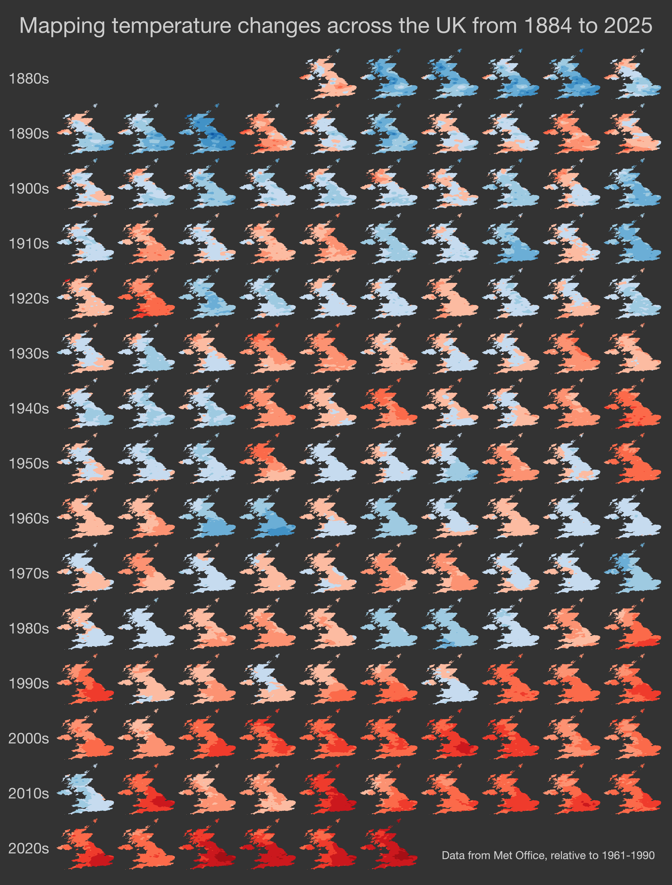

## Mapping temperature change with small multiples

### Global temperatures each year from 1850 to 2025

### Global temperatures each decade from 1850s to 2020s

### UK temperatures each year from 1884 to 2025

### UK temperatures each decade from 1880s to 2020s

