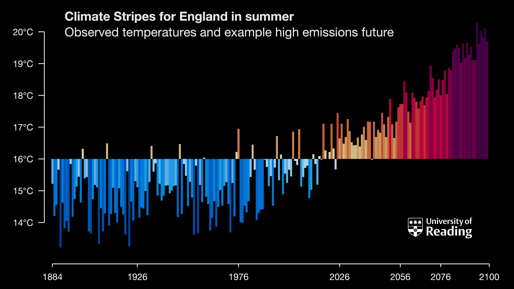
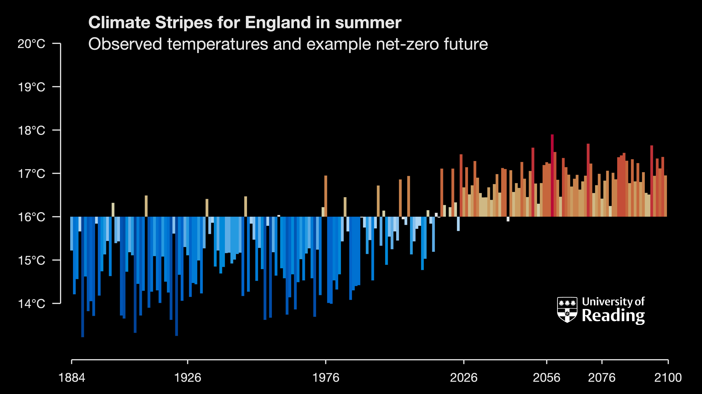
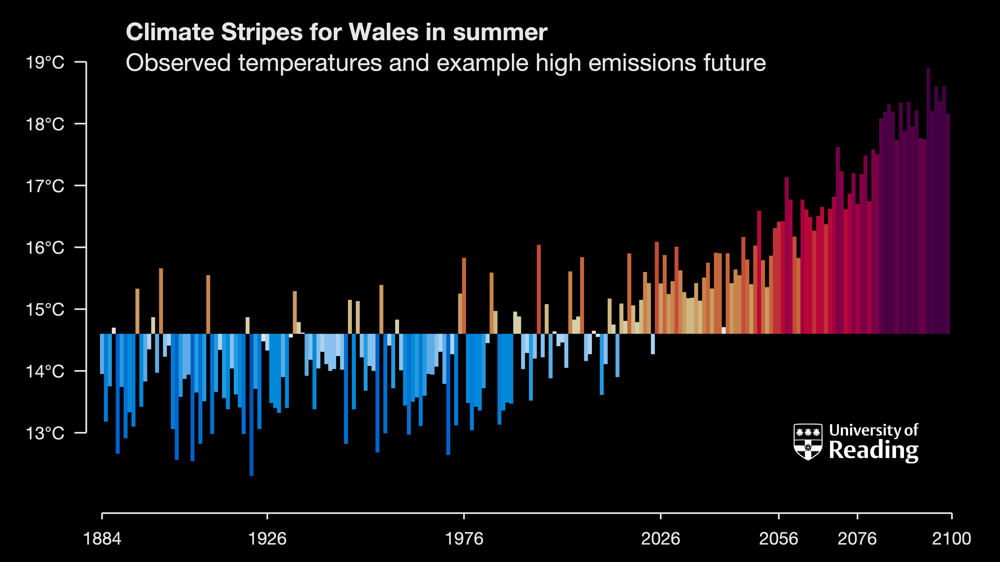
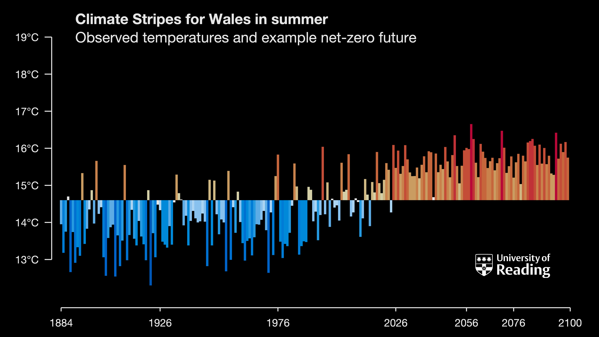
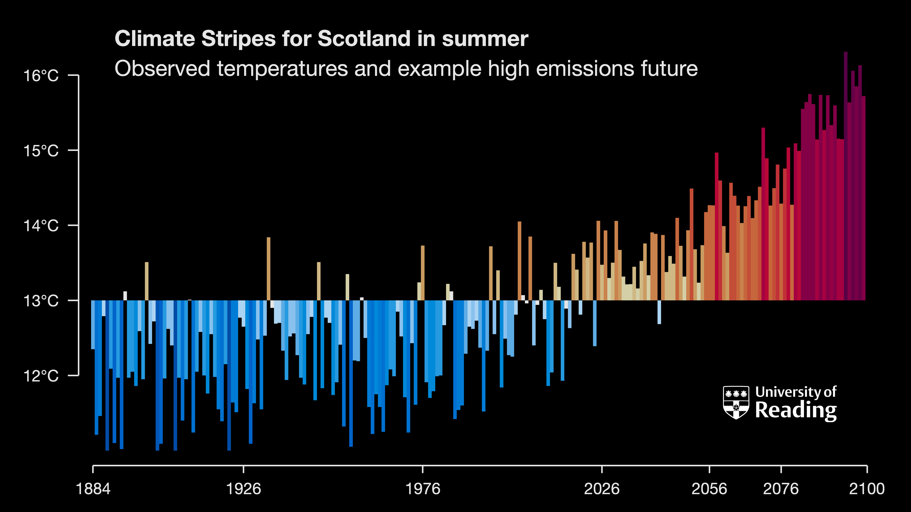
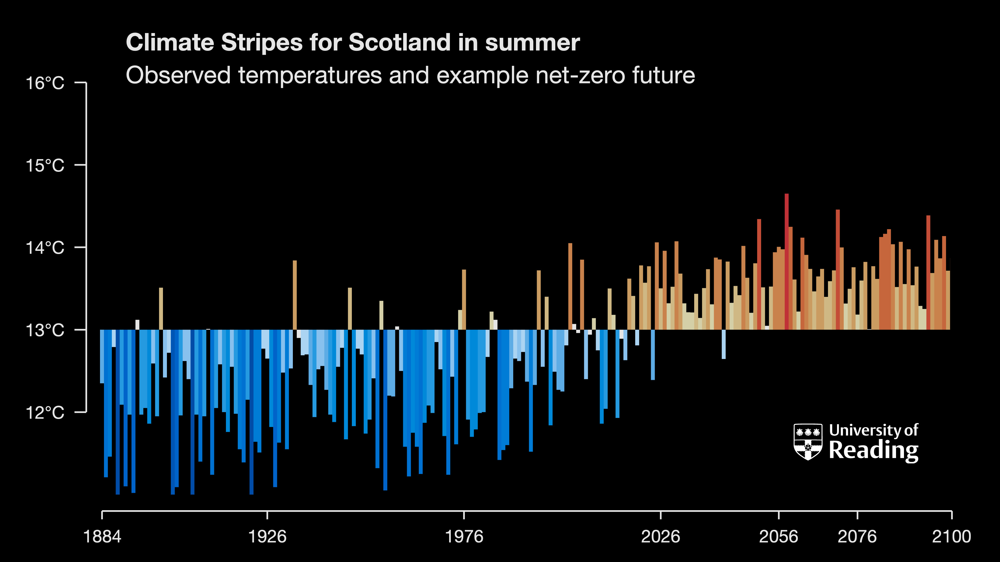
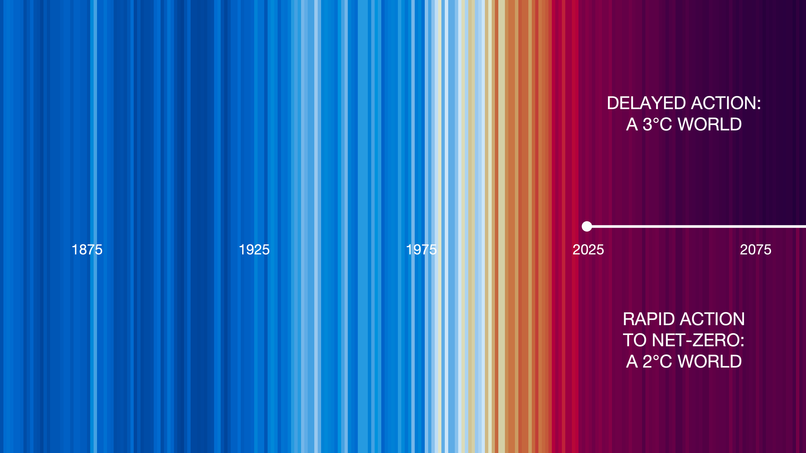

## The 'warning' stripes
Highlighting warming to date and different choices for future global climate

### Choosing between two possible futures for UK summers

### Choosing between two possible global futures

### Choosing between five possible global futures

