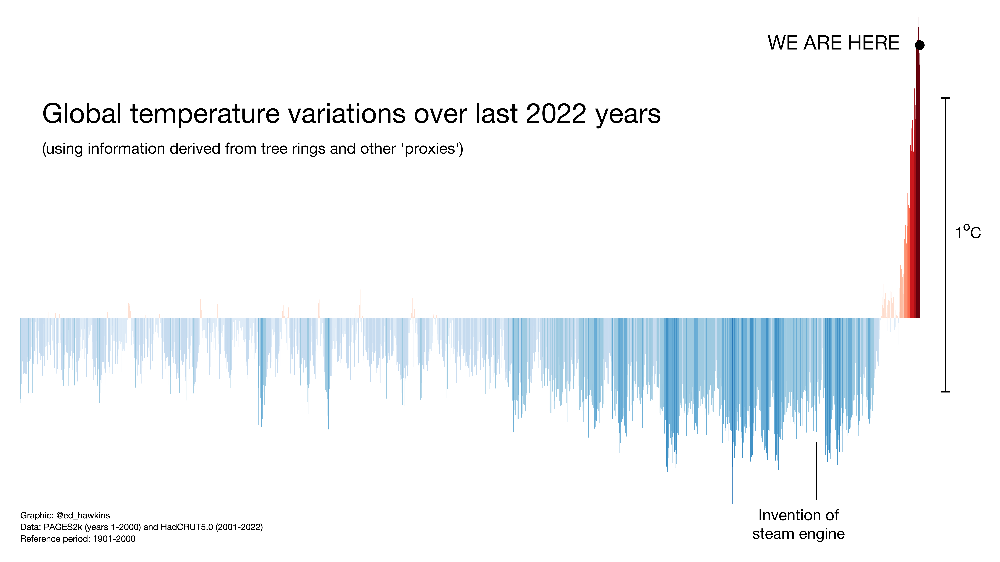
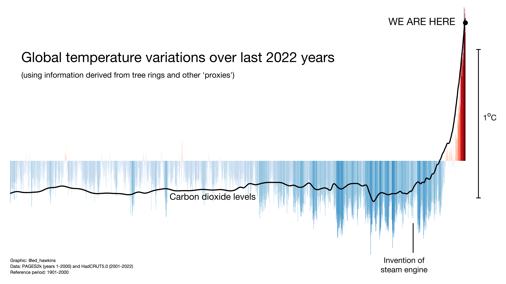
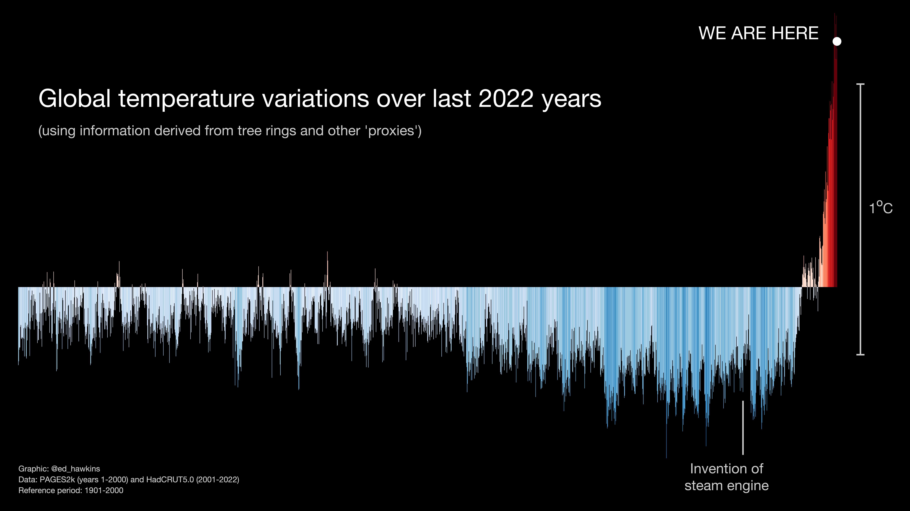

### Global warming stripes for the instrumental period

(*go to [ShowYourStripes.info](https://www.ShowYourStripes.info) to download similar graphics for every country, and individual regions and cities*)

### Global warming stripes for the last 2000 years

